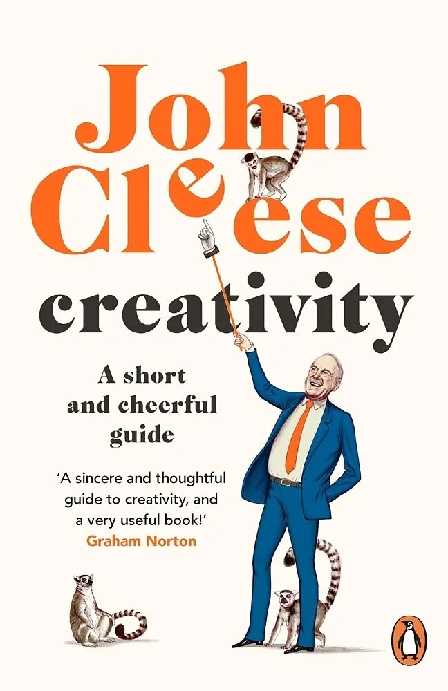
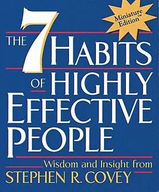

# 27. Calendar week

## Creativity

    <em>John Cleese • 23750 words</em>

<h3>Key takeaways</h3>

-   A
-   B
-   C

## The 7 Habits of Highly Effective People

    <em>Stephen R. Covey • 23750 words</em>

<h3>Key takeaways</h3>

-   A
-   B
-   C
